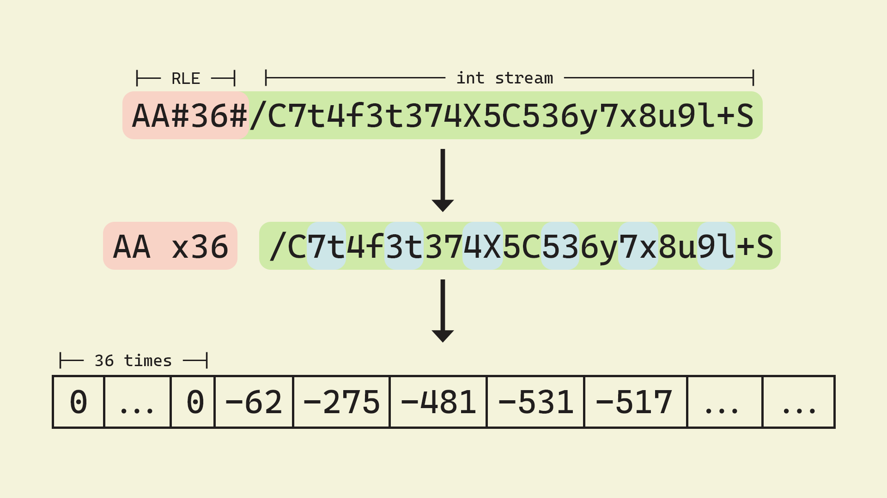

# UTAU resampler arguments documentation
 This markdown file details the terminal arguments that are passed down to a resampler when UTAU asks it to render a file. This will cover how it is done and what the arguments are in detail. This will not cover wavtool arguments as I do not know what they are supposed to be yet... oops.

## Contents
 1. [Resampler Arguments](#resampler-arguments)
    - [The actual arguments](#the-actual-arguments)
    - [Base64 decoding](#base64-decoding)
 2. [The Pitchbend Argument](#the-pitchbend-argument)
    - [The actual explanation](#the-actual-explanation)
 3. [Batch files](#batch-files)
    - [Common behaviors](#common-behaviors)
    - [Single threaded rendering](#single-threaded-rendering)
        - [temp-helper.bat](#temp_helperbat)
        - [temp.bat: single threaded](#tempbat-single-threaded)
    - [Multithreaded rendering](#multithreaded-rendering)
        - [tempn.bat](#tempnbat)
        - [temp.bat: multithreaded](#tempbat-multithreaded)

# Resampler Arguments
 The resampler receives instructions on how to resample the note through terminal arguments. These commands are setup in [batch files that UTAU generates.](#batch-files) but for now we will be focusing on what the resampler sees, which is only the terminal arguments by default.
 
 Some resamplers override this method for faster rendering or doing other things. A few examples of this is moresampler (presumably for faster concatenation), and presamp (to get new calculations for automatic VCV/CVVC)

 **Fun fact:** Running `resampler.exe` in command prompt actually gives you a help text on its arguments! This is what it gives to you:

```
Voice resampler tool Ver14.02r
Copyright (C) 2008-2012 Ameya/Ayame
Usage is ...
resampler.exe <input wavfile> <output file> <pitch_percent> <velocity> [<flags> [<offset> <length_require> [<fixed length> [<end_blank> [<volume> [<modulation> [<pich bend>...]]]]]]]
flags:
    N : No formant filter
    G : (Re)Generate frequency list
    T : Export text frequency list
    B : Bressiness parameter. B0..B100, default B50
ex :
resampler.exe infile.wav outfile.wav 120 100 GB60
```

## The actual arguments
 The format of the resampler call is this:
 ```
 resampler in_file out_file pitch velocity [flags] [offset] [length] [consonant] [cutoff] [volume] [modulation] [tempo] [pitchbend]
 ```
 Anything in square brackets are optional arguments. This is what each argument is supposed to represent (italics mean optional arguments):

 | Argument | Description | Example |
 | :---: | --- | --- |
 | in_file | The path to the input wave file. | \path\to\input.wav |
 | out_file | The path to the output wave file. | \path\to\output.wav |
 | pitch | The center pitch of the note in musical notation. | C4 |
 | velocity | The consonant velocity of the note. | 100 |
 | *flags* | The flags for the note. `""` if there are no flags. | F1B0Y0H0 |
 | *offset* | The offset from the start of the sample in milliseconds. Everything before this point is cut off. Essentially the same as offset in the oto. | 1000 |
 | *length* | The length of the stretched area in milliseconds. | 1000 |
 | *consonant* | The point of the border of the stretched and unstretched area relative to the offset. The area before this point is generally unstretched unless consonant velocity is not 100, while the area after this point is stretched according to the length. Essentially the same as consonant in the oto. | 450 |
 | *cutoff* | The cutoff from either the end of the sample or relative from the offset. Everything after this point is cut off. Essentially the same as cutoff in the oto. | -700 |
 | *volume* | The volume of the render in percent read from the intensity note property | 100 |
 | *modulation* | The modulation of the render in percent read from the modulation note property. 100% modulation means the original pitch of the render shows through if the pitchbend is completely flat. | 0 |
 | *tempo* | The tempo of the note to help with pitchbend calculation. Always has a ! at the start. | !120 |
 | *pitchbend* | The pitchbend of the note. [More about it here.](#the-pitchbend-argument) | [Provided here.](#the-pitchbend-argument) |

**Tip:** It might be easy to to the consonant velocity calculations as a percentage, but consonant velocity 0 would mean the length of the consonant is 0 in this system. The actual calculation for consonant velocity to turn it into a multiplier is $2^{1-\frac{v}{100}}$
 
# The Pitchbend Argument
 The pitchbend argument is in a special format that reduces its space in the terminal arguments as Windows command prompt limits the amount of characters in a command to 8191 characters. This section is for explaining this format.

## The actual explanation
 The pitchbend argument is in Base64, where every two characters is considered to be a signed 12-bit integer. It also includes a form of run length encoding to make strings of the same pitch offset shorter.

 The run length encoding comes as a regular number surrounded by the `#` character. The number inside is the amount of repeats that the value last saved in the array.
 
 The array of integers that you get in return is an offset from the center pitch in cents. This gives a range of -2048 to 2047 cents, which is about two octaves higher and lower from the center pitch. The timestep of each point in this array is 15 UTAU ticks, which means it is relative to the tempo of the render. To convert the index from the array to seconds, you can use this equation: $$\frac{60i}{96t}$$

 Where $t$ is the tempo and $i$ is the index.

 **Fun fact:** Since the pitchbend argument is an array of integers, Mode2 bends are actually converted into Mode1 pitchbends on the fly!

 Here is an example of the pitchbend argument from an actual pitchbend: `AA#36#/C7t4f3t374X5C536y7x8u9l+S+z/F/H/E+9+y+l+W+G919l9X9K9B8684859B9O9f90+M+m+//X/t//ANAWAYAUAKAB`

 And here is an image to visualize part of the parsing of the pitchbend argument:
 
 

## Base64 decoding
 The character set used for the pitchbend's Base64 encoding is the same as the [RFC 4648 standard.](https://datatracker.ietf.org/doc/html/rfc4648#section-4) As long as you can read the Base64 stream and cut it up every 12 bits, you may convert the unsigned 12-bit integer into a signed format with similar code as this:
```rust
fn to_i12(x: i16) -> i16 {
    if (x >> 11) & 1 == 1 {
        x - 4096
    } else {
        x
    }
}
```
This is similar to turning the most significant bit into a negative, which is what [two's complement](https://en.wikipedia.org/wiki/Two%27s_complement) does.

# Batch files
 UTAU generates batch files (`.bat`) to go through the rendering process. Single-threaded and multithreaded UTAU rendering go by these in different ways.

## Common behaviors
 These batch files are written in `%temp%\utau1` which also makes this file location the resampler and wavtool's working directory. The temporarily rendered wave file when a selection is previewed gets saved in this location as well.

## Single threaded rendering
 `temp.bat` and `temp_helper.bat` are created in this mode of rendering.

### temp_helper.bat
 `temp_helper.bat` is a file that sends the commands to the resampler and wavtool. It checks if the temporary file exists in cache. The contents of this file is consistent as it is only a helper file.

 This is the contents of the file, with comments for clarity:

```bat
rem Checks if the note already exists in cache for skipping rendering
@if exist %temp% goto A
rem Checks if there's a different file with the same prefix.
@if exist "%cachedir%\%9_*.wav" del "%cachedir%\%9_*.wav"
rem Resampler arguments are passed over
@"%resamp%" %1 %temp% %2 %vel% %flag% %5 %6 %7 %8 %params%
:A
rem Wavtool arguments are passed over. The A goto is also on top
@"%tool%" "%output%" %temp% %stp% %3 %env%
```

 The arguments and variables in this file are sent by/exist in the more general [`temp.bat`](#tempbat-single-threaded). These are what each of them represent:

| Argument Position | Description |
| :---: | --- |
| %1 | The wave file from the voicebank the resampler takes for rendering. |
| %2 | The pitch the note is on. |
| %3 | Wavtool length argument. |
| %4 | Unused. |
| %5 | The offset from the start for the render area of the sample. |
| %6 | The length of the stretched area in milliseconds. |
| %7 | The unstretched area of the render. |
| %8 | The cutoff from the end of the full sample or from the offset for the render area of the sample. |
| %9 | The cache file number |

| Variable Name | Description |
| :---: | --- |
| temp | The location of the temporary file where the render gets saved. |
| cachedir | The location of the cache folder. |
| resamp | The resampler to use for rendering. |
| vel | The consonant velocity of the note. |
| flag | The flags of the note. |
| params | Extra parameters sent for the resampler. |
| tool | The wavtool to use for rendering. |
| stp | The starting point of the note. |
| env | The envelope of the note. |

### temp.bat: single threaded
 `temp.bat` is a file that puts all the required calls to render all the notes and concatenate them at the same time.
 
 The general flow of the batch file is to set global variables, changing them as the render goes by if needed, running `temp_helper.bat` for the actual rendering and also displaying the progress bar in the terminal window.

 The call for `temp_helper.bat` is always in this form:
 ```bat
 @call "temp_helper.bat" "\path\to\sample.wav" pitch wavtool-length unused offset length consonant cutoff cache-file-number
 ```

 Here is an example of the file, with a few things changed for clarity:
```bat
@rem project=きらきら星
@set loadmodule=
@set tempo=120
@set samples=44100
@set oto=\path\to\voicebank\folder
@set tool=\path\to\wavtool
@set resamp=\path\to\resampler
@set output=temp.wav
@set helper=temp_helper.bat
rem Cache path is always in the folder of the .ust file with the folder name being ust_filename.cache
@set cachedir=\path\to\cache
@set flag=""
@set env=0 5 35 0 100 100 0
@set stp=0

@del "%output%" 2>nul
@mkdir "%cachedir%" 2>nul

@set params=100 0 !130 AA#27#
@set env=0 5 35 0 100 100 0 60
@set vel=100
@set temp="%cachedir%\8_お_F4_AfwMdY.wav"
@echo ######----------------------------------(1/n)
@call %helper% "%oto%\お.wav" F4 480@130+50.0 109 -105.0 550 179.0 -227.0 8
@set params=100 0 !130 AA#115#/+/4/v
@set env=0 5 35 0 100 100 0 60
@set vel=100
@set temp="%cachedir%\9_そ_F4_Zs9qOP.wav"
@echo ###########-----------------------------(2/n)
@call %helper% "%oto%\そ.wav" F4 480@130+103.0 119 -8.0 600 145.0 -199.0 9

rem ... other notes.

@echo ##################################------(n-1/n)
@call %helper% "%oto%\し.wav" D4 480@130+73.0 101 -14.0 600 123.0 -170.0 13
@set params=100 0 !130 DI#12#DGC9CuCZCBBmBLAyAdANAD
@set env=60 5 35 100 100 100 0 60
@set vel=100
@set temp="%cachedir%\14_よ_C4_YZFDZd.wav"
@echo ########################################(n/n)
@call %helper% "%oto%\よ.wav" C4 480@130+88.0 88 -8.0 600 173.0 -255.0 14

@if not exist "%output%.whd" goto E
@if not exist "%output%.dat" goto E
copy /Y "%output%.whd" /B + "%output%.dat" /B "%output%"
del "%output%.whd"
del "%output%.dat"
:E
```

The last few commands for `temp.bat` only includes the concatenation of `.whd` and `.dat` files, which are the wave file header data and the wave file data block correspondingly. The origins of this behavior (why `.whd` and `.dat` files are made) is yet to be investigated.

## Multithreaded rendering
 `temp.bat` and `tempn.bat` are created for this mode of rendering. This mode of rendering can only be accessed by shareware UTAU by enabling it in `Tools -> Option -> Rendering -> Multiple processes for rendering (use batch files)`

### tempn.bat
 These are multiple batch files filled with pure resampler calls and for displaying the progress bar in each terminal window instance. The amount of batch files that exists depend on how many processes are set for the option mentioned above. For some reason, this starts from `temp2.bat` and ends at `temp2+n.bat`, with n being the number of processes set.

 Here is an example of the general structure of the file generated:
```bat
@set loadmodule=
@echo #---------------------------------------(1/n)
@"\path\to\resampler" "\path\to\sample.wav" "\path\to\cache\render.wav" pitch velocity flags offset length consonant cutoff volume modulation tempo pitchbend
@echo ####------------------------------------(5/n)
@"\path\to\resampler" "\path\to\sample.wav" "\path\to\cache\render.wav" pitch velocity flags offset length consonant cutoff volume modulation tempo pitchbend
@echo ####------------------------------------(9/n)
@"\path\to\resampler" "\path\to\sample.wav" "\path\to\cache\render.wav" pitch velocity flags offset length consonant cutoff volume modulation tempo pitchbend
rem ... the rest of the notes set for this instance
```

### temp.bat: multithreaded
 This batch file is filled with pure wavtool calls to concatenate every sample. Nothing else special is in this file.